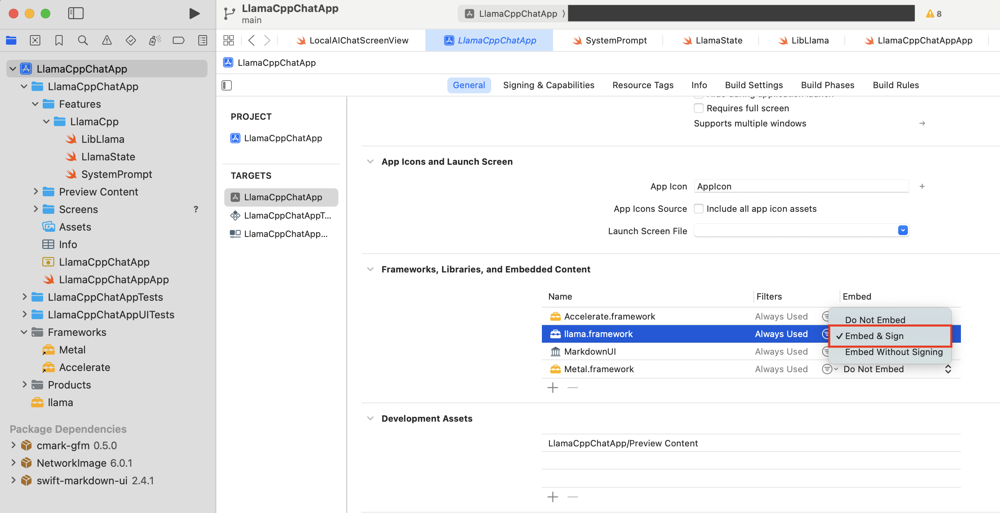

# 環境構築

### 1. このプロジェクトをclone
```terminal
git clone https://github.com/IkeuchiRyuto/LlamaCppChatApp.git
```

### 2. llama.cppをローカルにclone
```terminal
git clone https://github.com/ggml-org/llama.cpp.git
```

### 3. 以下のコマンドを実行
```terminal
./build-xcframework.sh
```

### 4. llama.frameworkを見つける
llama.cppフォルダ直下にある「build-ios-device」に移動


<br>

「framework」に移動


<br>

「llama.framework」があることを確認


<br>

このプロジェクトをXcodeで開いて、先ほどの」「llama.framework」をプロジェクト直下に移動させる


<br>

TARGETS→Build Phases→Link Binary With Librariesに「llama.framework」があることを確認


<br>

TARGETS→General→Frameworks,Libraries,and Embedded Content内にある「llama.framwork」のEmbedを**Embed & Sign**に変更



### 5. 起動

